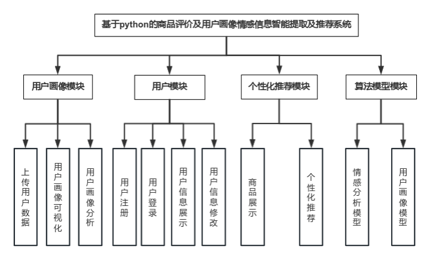
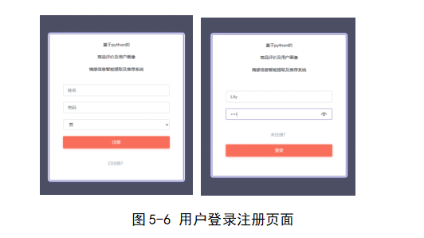
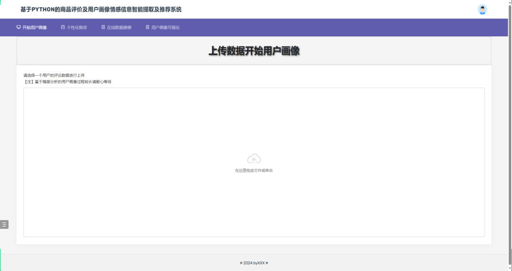
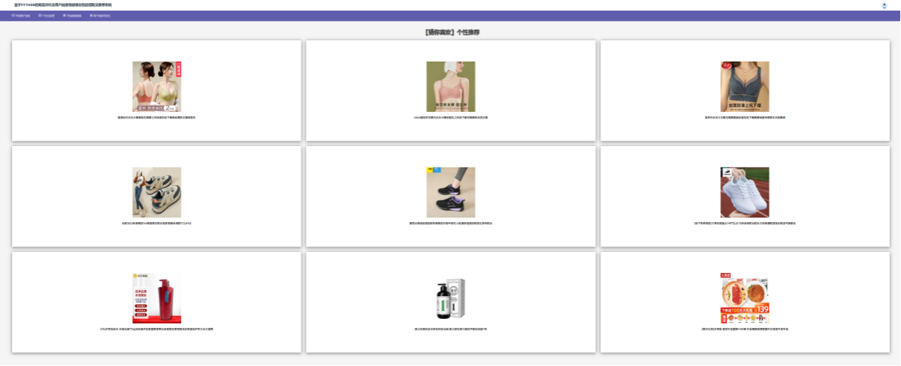

# 基于Django的在线商品评论情感分析Web系统

#### 介绍

基于Django的在线商品评论情感分析Web系统，可以上传你的商品评论数据进行训练，或者输入单条商品评价进行预测

#### 软件架构

> 基于python的商品评价及用户画像情感信息智能提取及推荐系统主要分为以下几个模块：用户画像模块、用户模块、算法模型模块、个性化推荐模块

**用户画像建模**

**个性化推荐功能**

**用户画像可视化**

#### 安装教程

1. pip install django4.2.3
2. 在settings.py文件中，修改mysql数据库的账号密码。
3. pip install -r requirements.txt
4. 运行的方式：在pycharm中找到运行按钮运行程序；在manage.py文件路径下打开cmd，输入python manage.py runserver运行程序
